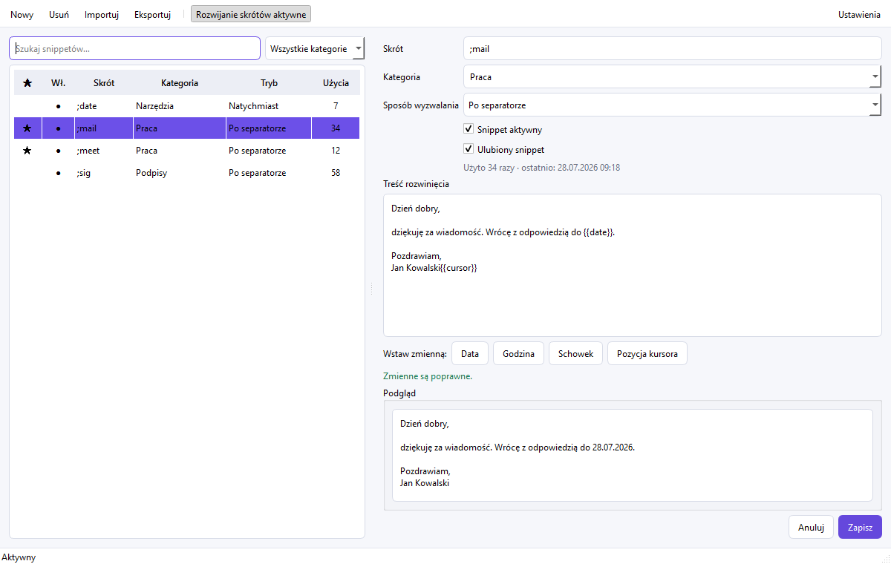

# QuickType

[](https://github.com/grzesiokk/textexpander/actions/workflows/windows-build.yml)

QuickType is a private, portable text expander for 64-bit Windows 11. It runs
locally, stores its SQLite database beside the executable, and does not require
Python on the target computer.

## Application preview



## Ready-to-use application

**[Download the latest QuickType.exe](https://github.com/grzesiokk/textexpander/releases/latest/download/QuickType.exe)**

Prebuilt Windows binaries are published under
[GitHub Releases](https://github.com/grzesiokk/textexpander/releases). The
`dist` directory is intentionally not committed to Git. When building the
project locally, the resulting application is created at:

```text
dist\QuickType.exe
```

Copy `QuickType.exe` to a writable folder, then start it with a double-click.
On first launch it creates:

```text
QuickTypeData\quicktype.sqlite3
```

Keep `QuickType.exe` and `QuickTypeData` together when moving the application.
Close QuickType from its tray menu before copying its database.

## Using snippets

1. Click **New** / **Nowy**.
2. Enter an abbreviation without whitespace, for example `;sig`.
3. Optionally assign a category and target applications, then enter the
   expansion text and choose a trigger mode.
4. Save the snippet and try it in Notepad, Word, a browser, VS Code, or Windows
   Terminal.

Use **Duplicate** / **Duplikuj** or `Ctrl+D` to create an editable copy of the
selected snippet. Its abbreviation receives a unique `_copy` suffix.

Right-click a snippet to enable or disable it, change its favorite status,
duplicate it, or delete it. Double-click the star or enabled-state column for a
quick toggle.

Use **Categories** / **Kategorie** to see how many snippets belong to each
category, rename a category across the whole library, or remove the category
assignment without deleting its snippets.

Trigger modes:

- **After delimiter** expands after Space, Tab, Enter, or common punctuation
  and replays the delimiter.
- **Immediate** expands as soon as the final abbreviation character is typed.

Supported variables:

| Variable | Result |
|---|---|
| `{{date}}` | Date as `DD.MM.YYYY` |
| `{{date:%Y-%m-%d}}` | Date with a Python `strftime` format |
| `{{time}}` | Time as `HH:MM` |
| `{{time:%H:%M:%S}}` | Time with a custom format |
| `{{clipboard}}` | Plain text currently in the clipboard |
| `{{cursor}}` | Final cursor position; may occur once |

The interface can be switched between Polish and English in Settings.
Closing the main window keeps QuickType in the system tray. The tray menu can
pause expansion, enable autostart, reopen the window, or quit completely.

## Quick access

Press **Ctrl+Alt+Space** in another application to open a searchable list of
enabled snippets. Search by abbreviation, category, or expansion text, then
press **Enter** to insert the selected snippet into the original window.
Template variables and the cursor marker are rendered in the same way as with
typed abbreviations. **Esc** closes the quick-access window without inserting.
Mark important snippets as favorites to keep them at the top of this list.
Other snippets are ordered by their usage count.

The global shortcut can be changed immediately in Settings to
**Ctrl+Shift+Space**, **Alt+Shift+Space**, or disabled completely.

## Application-specific snippets

Enter executable names such as `Code.exe`, `WINWORD.EXE`, or `chrome.exe` in a
snippet's **Only in applications** field to restrict it to those programs.
Separate multiple names with commas. Leave the field empty to make the snippet
available everywhere. Application matching is case-insensitive and is applied
to both typed abbreviations and the quick-access picker.

## Backups, statistics, and exclusions

- Snippets can be organized into categories. Use the category selector above
  the list to filter the library; category names are preserved in backups.
- Category changes are applied transactionally to every affected snippet and
  trigger the same automatic backup protection as ordinary edits.
- Favorite status is shown with a star and is also preserved in backups.
- Per-snippet application rules are preserved in backups.
- **Export** creates a human-readable UTF-8 JSON backup containing all snippets
  and their usage statistics.
- Automatic backups are enabled by default. QuickType writes them after snippet
  changes to `QuickTypeData\Backups` and keeps the latest 20 copies. This can be
  disabled in Settings.
- **Restore** / **Przywróć** shows the available automatic backups with their
  dates and snippet counts. Before replacing the library, QuickType saves an
  additional `QuickType-before-restore-*.json` safety copy of the current state.
- **Import** can replace the current library or merge a backup while skipping
  abbreviations that already exist.
- The snippet list shows how many times each abbreviation has expanded. The
  editor also shows the most recent use.
- Settings contains an excluded-applications list. Enter one executable name
  per line, such as `KeePass.exe`, to prevent expansion in that process.

## Safety and Windows limitations

- Typed text is held only in a short in-memory matching buffer and is never
  persisted or logged.
- Expansion is skipped when Windows UI Automation identifies the focused
  control as a password field.
- Windows blocks `SendInput` into applications running at a higher integrity
  level. An ordinary QuickType process therefore cannot expand text inside an
  application started as Administrator.
- A multiline snippet used in a terminal may execute commands. Review terminal
  snippets carefully.
- The personal build is unsigned, so Microsoft SmartScreen may show a warning.

## Development

Requirements:

- Windows 11 x64
- Python 3.12
- PowerShell

Create a virtual environment and install dependencies:

```powershell
python -m venv .venv
.\.venv\Scripts\python.exe -m pip install -e ".[build,test]"
```

Run from source:

```powershell
.\.venv\Scripts\python.exe -m quicktype
```

Run tests:

```powershell
.\.venv\Scripts\python.exe -m pytest
```

The [release verification checklist](docs/TESTING.md) covers automated and
manual Windows 11 checks. The [development status](ROADMAP.md) records the
completed phases and the deliberately excluded cloud features.

Build the single-file, windowed executable:

```powershell
.\build.ps1
```

If Python is not on `PATH`, set `QUICKTYPE_PYTHON` to a Python 3.12 executable
before running `build.ps1`. Use `.\build.ps1 -SkipInstall` to reuse the current
virtual environment without reinstalling dependencies.

## Data and privacy

QuickType has no network integration, telemetry, synchronization, or cloud
storage. Snippets and settings remain in the local SQLite database.

The project is licensed under the MIT License. PySide6/Qt and other packaged
dependencies retain their respective upstream licenses.
